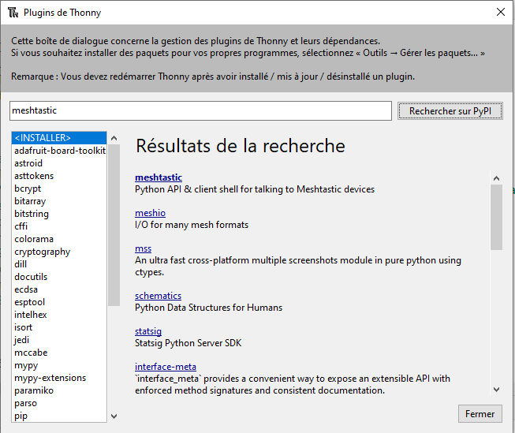
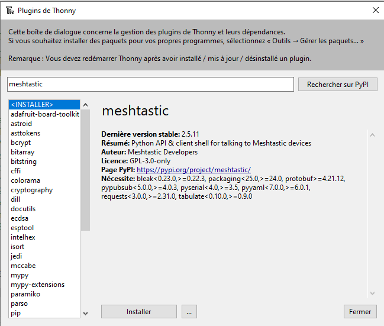
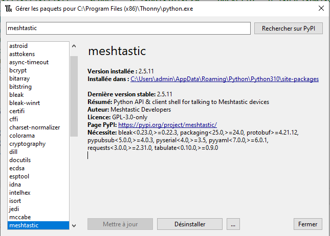
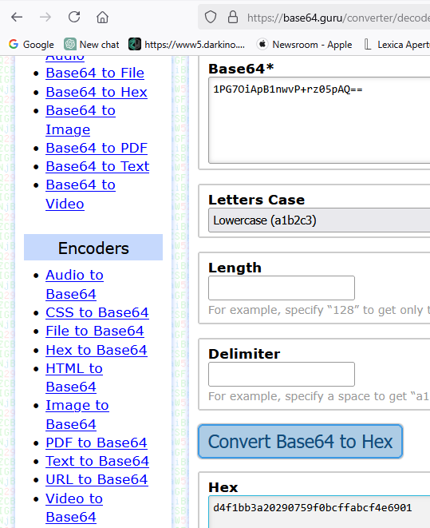
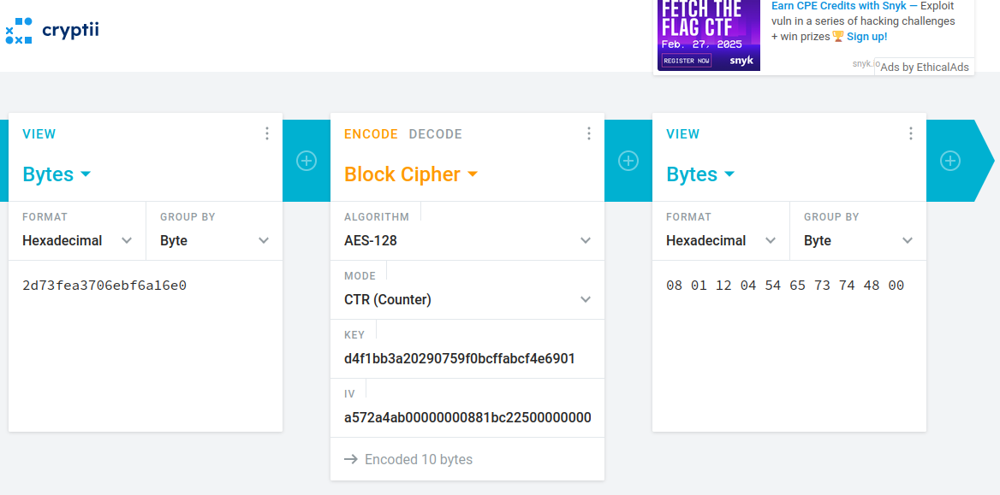

# Meshtastic-software

- Mesh_lora_proto_decode

	- RX Meshtastic frame in standard Long Fast key AQ== 
	- Print in the serial console numPort=1 only(short text message)
	- Message Led1 : switch on the led
	- Message Led0 : switch off the led
	
- mesh_protobuf

	- Unit test programming : decode a message with protobuf 

- python-decode

	- Decode raw Mestastic data frame and print the message 

- quick_protobuf_tuto

	- Basic protobuf tutorial (very simple)

- TestCTR_decrypt

	- Unit test programming : AES128 decrypt test

- testStructure

	- Unit test programming : complete Mestastic data frame and AES128 decrypt test
	

# Meshtastic-technical links	

- [radio-settings](https://meshtastic.org/docs/overview/radio-settings/)

- [Mestastic algorithm](https://meshtastic.org/docs/overview/mesh-algo/)

```
Meshtastic AES-128 decrypt in CTR mode
raw mesh text message 0xFF, 0xFF, 0xFF, 0xFF, 0x88, 0x1B, 0xC2, 0x25, 0xA5, 0x72, 0xA4, 0xAB, 0x63, 0x8, 0x0, 0x0, 0x2D, 0x73, 0xFE, 0xA3, 0x70, 0x6E, 0xBF, 0x6A, 0x16, 0xE0
key =  0xd4, 0xf1, 0xbb, 0x3a, 0x20, 0x29, 0x07, 0x59, 0xf0, 0xbc, 0xff, 0xab, 0xcf, 0x4e, 0x69, 0x01
plaintext = 0x08, 0x01, 0x12, 0x04, 0x54, 0x65, 0x73, 0x74, 0x48, 0x00 //payload decrypted
ciphertext = 0x2d, 0x73, 0xfe, 0xa3, 0x70, 0x6e, 0xbf, 0x6a, 0x16, 0xe0  //payload crypted
iv = 0xa5, 0x72, 0xa4, 0xab, 0x00, 0x00, 0x00, 0x00,0x88, 0x1b, 0xc2, 0x25, 0x00, 0x00, 0x00, 0x00 //cypher init
size = 10
Message received : Test
```


# Protobuf links

[protobuf tutorial](https://techtutorialsx.com/2018/10/19/esp32-esp8266-arduino-protocol-buffers/)
	
[protobuf decoder](https://protogen.marcgravell.com/decode)

[Mestastic protobuf](https://github.com/meshtastic/firmware/tree/master/src/mesh/generated/meshtastic)


```
Key length 32 bytes
meshtasticFullKeyHex d4f1bb3a20290759f0bcffabcf4e6901   :128 bits
##### PACKET DATA START #####
dest ffffffff sender 25c21b88
id 38757527
flags 63
chanhash 08
data 2d73fea3706ebf6a16e0
##### PACKET DATA END #####
{'dest': b'\xff\xff\xff\xff', 'sender': b'\x88\x1b\xc2%', 'packetID': b'\xa5r\xa4\xab', 'flags': b'c', 'channelHash': b'\x08', 'reserved': b'\x00\x00', 'data': b'-s\xfe\xa3pn\xbfj\x16\xe0'}
AES nonce is:  a572a4ab00000000881bc22500000000
AES key used:  b'1PG7OiApB1nwvP+rz05pAQ=='
Nonce length is: 16
dec: 08011204546573744800
b'\x08\x01\x12\x04TestH\x00'
data.portnum 1
TEXT_MESSAGE_APP b'\x88\x1b\xc2%' -> b'\xff\xff\xff\xff' Test
```


# Install Mestastic libraries for [thonny](https://thonny.org/)







# Base 64 decoder

[base64 decoder](https://base64.guru/converter/decode/hex)




# AES decryption

[AES decryption](https://cryptii.com/pipes/aes-encryption)




