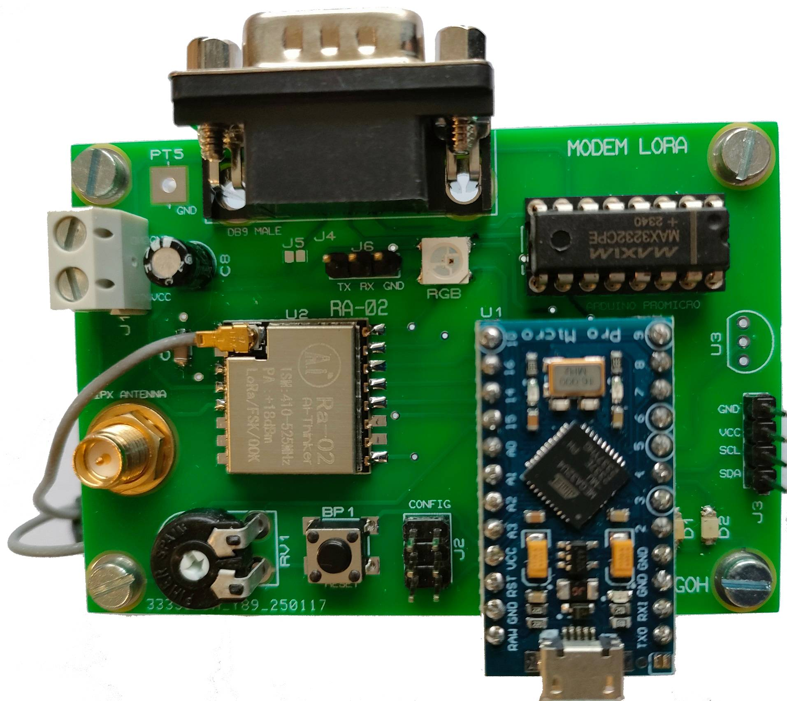
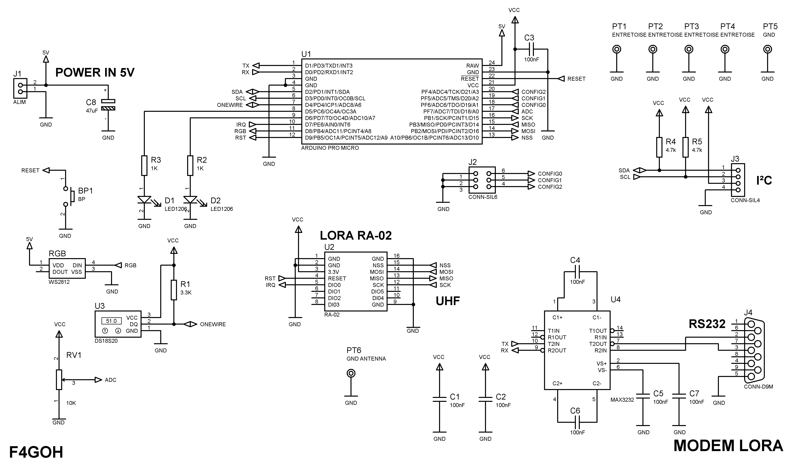
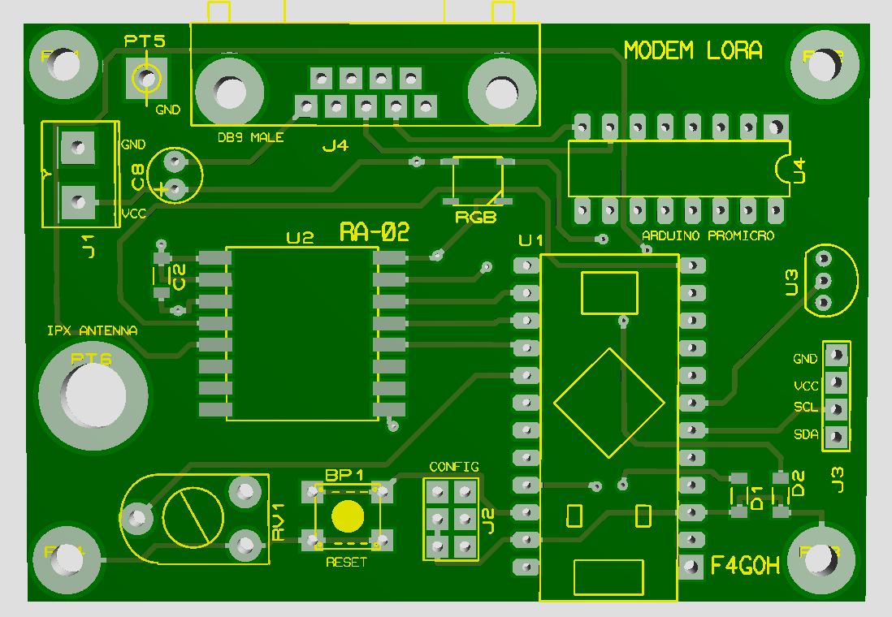
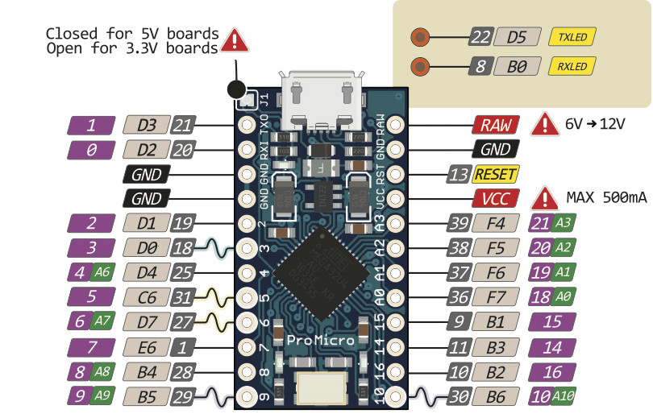
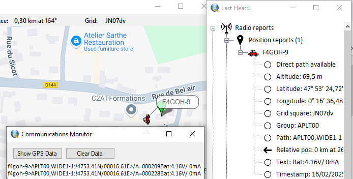
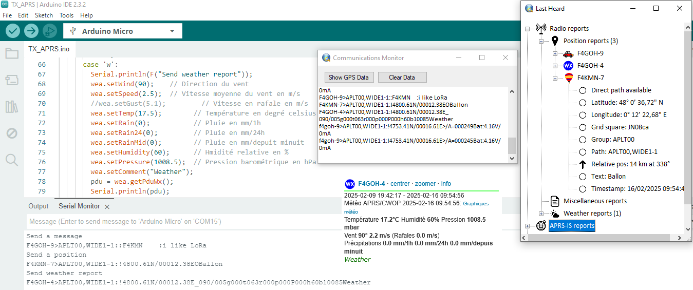

# Modem-LoRa

This card provide a very simple and versatile platform for developing experiments around [LoRa](https://en.wikipedia.org/wiki/LoRa) transmission.

---
## features

- Arduino micro based on the ATmega32U4
- virtual (CDC) serial / COM port. (Serial)
- hardware External sérial (Serial1) RS232 with max3232
- RA-02  sx1278 Module
- Power supply 5V but GPIO 3.3V only
- I2C Interface
- Potentiometer
- Sensor temperature DS18B20
- One RGB LED WS2812B

Numerous software examples are provided, such as :

- Simple LoRa point-to-point transmission
- Transmission of APRS frames 
	- Message
	- Position
	- Weather
- KISS LoRa serial interface with pinAPRS or YAAC software - Yet Another APRS Client

- Analysis of the protocol used by the [meshtastic](https://meshtastic.org/) open source project
	- AES128 decryption
	- Discover [protobuf](https://en.wikipedia.org/wiki/Protocol_Buffers) (free and open-source cross-platform data format used to serialize structured data)
	- Understand the transmission of packets around [meshtastic](https://meshtastic.org/docs/overview/mesh-algo/)
---
# Schematics

# PCB

# Arduino Micro ATmega32U4 pinout

---

# APRS KISS

# APRS 3 messages sent

