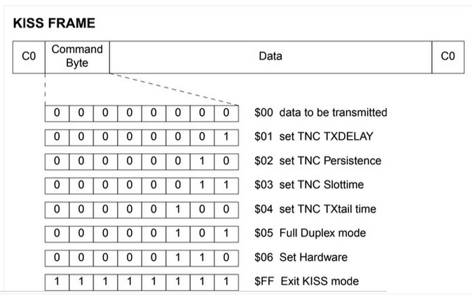

# APRS-software

- KISS_class.ino

	- RX and TX APRS LoRa with Kiss data protocol on USB serial 9600 bauds 

- LoRaReceiver_simple.ino

	- Just a LoRa receiver. Print raw data on USB serial 
	
- TX_APRS.ino

	-  Send APRS message, position , weather when key m,p,w is sent in serial console

# KISS [protocol](https://notblackmagic.com/bitsnpieces/ax.25/)




# Message exemple

- LoRa Aprs message
F4GOH-1>APIN21,WIDE1-1,WIDE2-1::F4KMN-2  :Test{1

- Same message but with KISS + AX28 protocol

```
0000   c0 00 82 a0 92 9c 64 62 60 8c 68 8e 9e 90 40 62   ......db`.h...@b
0010   ae 92 88 8a 62 40 62 ae 92 88 8a 64 40 63 03 f0   ....b@b....d@c..
0020   3a 46 34 4b 4d 4e 2d 32 20 20 3a 54 65 73 74 7b   :F4KMN-2  :Test{
0030   31 c0                                             1.
```

# Position exemple

- LoRa Aprs message
f4goh-9>APLT00,WIDE1-1:!4753.41N/00016.61E>/A=000219Bat:4.17V/ 0mA

- Same message but with KISS + AX28 protocol
```
0000   c0 00 82 a0 98 a8 60 60 60 cc 68 ce de d0 40 72   ......```.h...@r
0010   ae 92 88 8a 62 40 63 03 f0 21 34 37 35 33 2e 34   ....b@c..!4753.4
0020   31 4e 2f 30 30 30 31 36 2e 36 31 45 3e 2f 41 3d   1N/00016.61E>/A=
0030   30 30 30 32 31 39 42 61 74 3a 34 2e 31 37 56 2f   000219Bat:4.17V/
0040   20 30 6d 41 c0   
```

# APRS KISS


# APRS 3 messages sent


