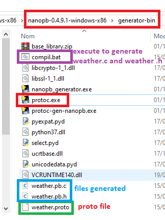
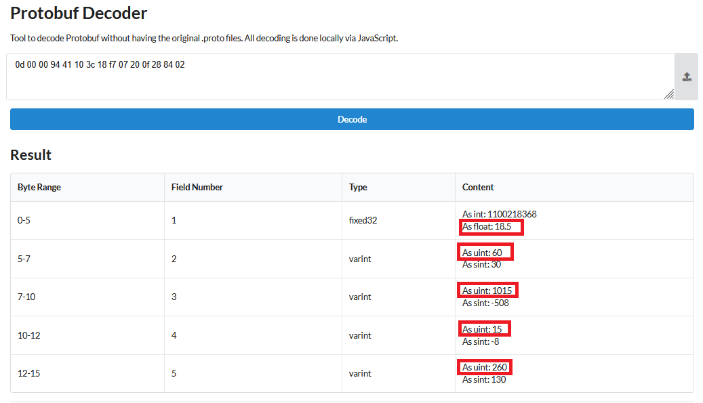

# LoRa simple text modem (no protobuf)

- LoRa_modem_noproto.ino

```
LoRa simple text modem
message send : Hello
Received packet 'good morning' with RSSI -58
```

# protobuf exemples

- quick_protobuf_tuto

	- Basic from [protobuf tutorial](https://techtutorialsx.com/2018/10/19/esp32-esp8266-arduino-protocol-buffers/) (very simple)

- Transmit data with LoRa RF with protobuf Weather exemple

	- TX_proto_lora.ino

- Receive data with LoRa RF with protobuf Weather exemple

	- RX_proto_lora.ino


# [protobuf](https://protobuf.dev/programming-guides/proto3/) brief

  
|Proto Type	|Notes|
|---    |:--    |
|double	|	|
|float	|	|
|int32	|Uses variable-length encoding. Inefficient for encoding negative numbers – if your field is likely to have negative values, use sint32 instead.|
|int64	|Uses variable-length encoding. Inefficient for encoding negative numbers – if your field is likely to have negative values, use sint64 instead.|
|uint32	|Uses variable-length encoding.|
|uint64	|Uses variable-length encoding.|
|sint32	|Uses variable-length encoding. Signed int value. These more efficiently encode negative numbers than regular int32s.|
|sint64	|Uses variable-length encoding. Signed int value. These more efficiently encode negative numbers than regular int64s.|
|fixed32 |	Always four bytes. More efficient than uint32 if values are often greater than 228.|
|fixed64 |	Always eight bytes. More efficient than uint64 if values are often greater than 256.|
|sfixed32 |	Always four bytes.|
|sfixed64 |	Always eight bytes.|
|bool	|	|
|string	|A string must always contain UTF-8 encoded or 7-bit ASCII text, and cannot be longer than 2<sup>32sup>.|
|bytes	|May contain any arbitrary sequence of bytes no longer than 2<sup>32sup>.|

## Specifying Field Cardinality

Message fields can be one of the following:

    - optional: (recommended) An optional field is in one of two possible states:
            the field is set, and contains a value that was explicitly set or parsed from the wire. It will be serialized to the wire.
            the field is unset, and will return the default value. It will not be serialized to the wire.


    - repeated: this field type can be repeated zero or more times in a well-formed message. The order of the repeated values will be preserved.

    - map: this is a paired key/value field type. See [Maps](https://protobuf.dev/programming-guides/encoding/#maps) for more on this field type.
	

# Meshtastic-technical [links](https://meshtastic.org/docs/overview/mesh-algo/)	


```cpp
  LoRa.setPreambleLength(16);  //mesh
  LoRa.setSyncWord(0x2b);      //mesh
 ``` 

# Generate .h and .c files with protoc

```
protoc --nanopb_out=. weather.proto
```



# [decode messages on line](https://protobuf-decoder.netlify.app/) or [protogen decoder](https://protogen.marcgravell.com/decode)

