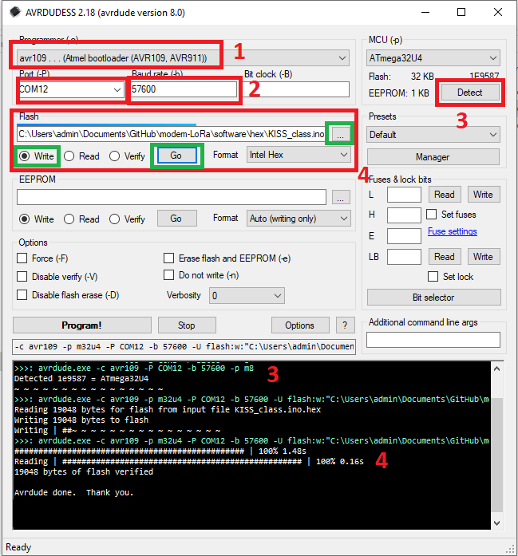

# Program Hex file in an Arduino micro

Quick programming with [AVRDUDESS 2.18](https://github.com/ZakKemble/AVRDUDESS/releases)

- Serial terminal 57600 bauds
- Avr 109 programmer

How to program a HEX file with Avrdudess on an ATmega32U4 microcontroller with a bootloader?

COM port in bootloader mode: When in bootloader mode, the microcontroller appears on a different COM port 
(usually ephemeral and only visible in bootloader mode) to allow programming via USB. 
This is where you upload your new code.
As soon as you press the reset button, it takes a second. You need to be quick and identify the COM port number.
Then the COM port with the new number goes into CDC (Communication Device Class) mode: Once the code has been uploaded and the microcontroller restarted in normal execution mode, it uses another COM port in serial CDC mode for serial communications with the computer or other devices. This port is used for serial interactions such as transmitting data, receiving commands, etc.

So there are two separate COM ports: one for the programming process via the bootloader (active for one second as soon as the reset button is pressed), and the other for serial communications in normal operating mode.

Under Windows, the characteristic sound of loading and changing the USB serial port is identifiable.

- KISS_class.ino.hex : TNC KISS LoRA 9600 bauds Serial CDC (Communication Device Class)

- Mesh_lora_proto_decode.ino.hex : Listen a Meshtasic text message a print it on serial monitor

- TX_APRS.ino.hex : Send message, position , weather when key m,p,w is sent in serial console

